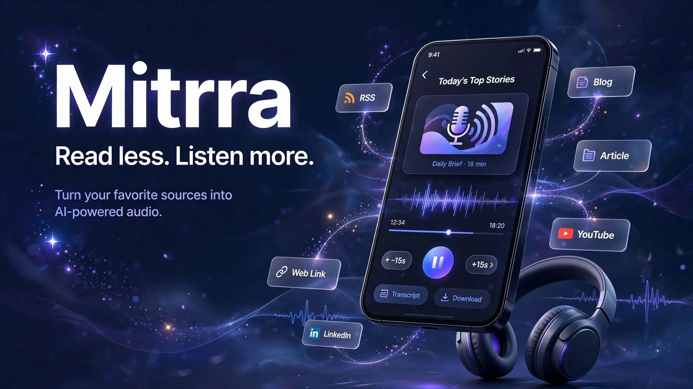

  

# Mitrra 🎧

### Read less. Listen more.

**Turn your favorite sources — RSS feeds, blogs, articles, and links — into short, AI-generated audio podcasts you can listen to on the go.**

---

## 📲 Download

**[Download APK — LINK_TO_BE_ADDED_HERE]**

Direct install on Android. No Play Store required. Enable "Install from unknown sources" if prompted.

---

## 🌟 What Mitrra Does

Instead of scrolling through articles and feeds every morning, this app collects content from sources you choose, summarizes it with AI, converts that summary into natural-sounding speech, and generates a matching cover image — so you get a ready-to-play mini podcast episode whenever you want one.

---

## 🧭 Features

### 1. Account & Profile

| Feature | What it does | How to use |
|---|---|---|
| Sign Up / Log In | Create an account with name, email, and password | On first launch, tap **Sign Up**. Returning users tap **Log In**. |
| Edit Profile | Change your display name and profile photo | Settings → tap your profile card → update name/photo → Save |
| Change Password | Update your account password securely | Settings → Account → Change Password |
| Delete Account | Permanently remove your account and all associated data (topics, episodes) | Settings → Account → Delete Account (requires confirmation) |
| Auto Login | Once logged in, you stay logged in across app restarts | No action needed — session is restored automatically |

### 2. Topics — Your Content Sources

A **Topic** is a folder that groups together the sources you want summarized into one episode.

| Feature | What it does | How to use |
|---|---|---|
| Create Topic | Start a new content category (e.g. "Tech News", "Startup Updates") | Sources tab → tap **+** → type a name |
| Add RSS Feed | Add any RSS feed URL to a topic | Open a topic → tap **+** → select **RSS Feed** → paste feed URL |
| Add Link | Add a link from a blog, news article, or public page (best-effort support for social platforms like Instagram, YouTube, LinkedIn, X, Facebook) | Open a topic → tap **+** → select **From Link** → choose platform → paste URL |
| Generate Episode (All Sources) | Combine every source inside a topic into a single episode | Open a topic → tap the **✨ sparkle icon** in the top bar |
| Generate Episode (Single Source) | Generate an episode using just one specific source in the topic | Inside a topic, tap the **✨ sparkle icon** next to any individual source row |
| Delete Topic / Source | Remove a topic or an individual source | Tap the trash icon → confirm in the alert |

> **Note on social media links:** Platforms like Instagram and LinkedIn actively block automated content extraction. The app will attempt to pull whatever public preview data is available (title/description), but full post content may not always be retrievable. RSS feeds and standard articles/blogs work most reliably.

### 3. Episodes & Player

| Feature | What it does | How to use |
|---|---|---|
| Episode List (Home) | Shows all your generated episodes, newest first | Home tab |
| Play / Pause | Standard playback controls | Tap the episode card's play button, or open the full player |
| Seek Bar | Tap-to-seek anywhere in the episode | Open an episode → drag or tap the progress bar |
| Skip ±15s | Quickly skip forward or back | Full player screen → skip icons beside the play button |
| Transcript | Read the full AI-generated script while listening | Full player screen → swipe to the **Transcript** tab |
| Feedback | Mark an episode 👍 or 👎 to reflect what you liked | Player screen or Transcript tab → tap thumbs icon |
| Mini Player | A persistent playback bar while browsing other tabs | Appears automatically above the tab bar when something is playing |
| Delete Episode | Remove an episode permanently | Home screen → tap the trash icon on any episode card |
| Cover Art | Every episode gets an AI-generated cover image based on its content | Shown automatically at the top of the player screen |

### 4. Offline Downloads

| Feature | What it does | How to use |
|---|---|---|
| Download Episode | Save an episode locally to play without internet | Home screen → tap the download icon on an episode card |
| Downloads Library | View and manage everything you've downloaded | Settings → Downloads |
| Storage Usage | See how much space your downloads are using | Settings → Storage Used |
| Clear All Downloads | Free up space in one tap | Settings → Storage → Clear All Downloads |

### 5. Notifications

| Feature | What it does | How to use |
|---|---|---|
| Daily Reminder | Get a push notification at a time you choose | Settings → Notifications → Daily Reminder → set time |

### 6. Appearance & Settings

| Feature | What it does | How to use |
|---|---|---|
| Dark / Light Mode | Switch the entire app's theme | Settings → Appearance → Dark Mode toggle |
| Help & Support | FAQs and a direct contact email | Settings → Support → Help & Support |
| About | App version, Terms of Service, Privacy Policy, Rate the App | Settings → Support → About |

---

## 🤖 How Episode Generation Works (Behind the Scenes)

1. **Ingestion** — Fetches articles from RSS feeds, or scrapes readable content from a pasted link
2. **Ranking** — Scores fetched articles by recency and relevance to the topic name
3. **Script Generation** — An AI model (Gemini) turns the top articles into a short, natural, conversational script (~2 minutes of spoken audio)
4. **Text-to-Speech** — The script is converted into a real voice recording
5. **Cover Art** — An AI image model generates unique cover art based on the episode's content
6. **Episode Saved** — Everything is bundled into a playable episode in your library

---

## 🛠 Built With

- **Frontend:** React Native (Expo) — cross-platform mobile app
- **Backend:** Node.js, Express, MongoDB
- **AI Script Generation:** Google Gemini
- **Text-to-Speech:** VoiceRSS
- **Image Generation:** Hugging Face Inference API
- **Hosting:** Railway (backend), MongoDB Atlas (database)

For full technical setup details, see [TECH.md](./TECH.md).

---

## 🚀 Future Updates (Roadmap)
 
Ideas being considered for upcoming versions:
 
- **Multi-language support** — generate transcripts and voice narration in languages beyond English (e.g. Hindi, Bengali), selectable per episode
- **Playback speed control** — 0.5x to 2x speed, like most podcast apps
- **Sleep timer** — auto-pause playback after a set duration
- **Voice selection** — let users pick a narrator voice/tone for their episodes instead of one default voice
- **Smarter ranking** — move from keyword-based article ranking to semantic/embedding-based relevance scoring for better source-to-topic matching
- **Recurring auto-generation** — let users schedule a topic to auto-generate a new episode daily/weekly instead of only manual generation
- **Episode chapters** — jump directly to the section of an episode covering a specific source article
- **Share episodes** — share a generated episode link with friends outside the app
- **Search** — search across episode titles and transcripts
- **Listening stats** — streaks, most-played topics, total listening time
- **Official social media integration** — richer Instagram/LinkedIn/X content support via their official APIs (currently limited by platform restrictions on public scraping)
- **iOS release** — currently Android-only via APK; iOS build and App Store release planned
- **Home screen widget** — quick access to the latest episode without opening the app
Have an idea not listed here? Suggest it via **Settings → Help & Support → Contact Support**.
 
---

## 📩 Feedback & Support

Found a bug or have a feature idea? Reach out via **Settings → Help & Support → Contact Support** inside the app.
